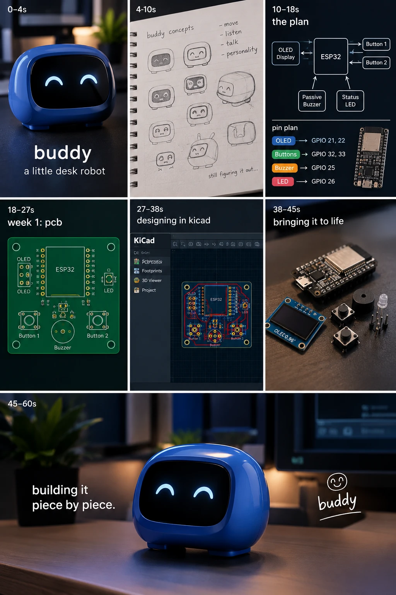

# buddy

a little desk robot.

eventually i want it to move around, listen to me, talk back, and actually feel
like it has a personality. right now it's a pcb and a plan.

built for hack club. this repo is the real record of it, including the parts i get
wrong.

---



that's the look i'm aiming at. i don't know what the final version will actually
end up like — that's kind of the point.

---

## where i'm at

| week | what | state |
|---|---|---|
| 1 | pcb — schematic and board in kicad | in progress |
| 2 | order the board, start the firmware | not started |
| 3 | assemble and bring it up | not started |
| later | movement, mic, speaker, personality | not started |

## what's on the board

| part | job | esp32 pin |
|---|---|---|
| 0.96" ssd1306 oled, i²c | buddy's face | 21 (sda), 22 (scl) |
| 2x tactile button | touch input | 32, 33 |
| passive piezo buzzer | sound | 25 |
| status led | "i'm awake" | 26 |
| esp32 | the brain | — |

the pin choices carry over from the breadboard prototype — see
[buddy-mini](https://github.com/nadellasripad11/buddy-mini), where i worked out
which esp32 pins are safe and which are off-limits.

## repo layout

```
buddy/
├── docs/            plans and notes
├── hardware/        kicad project — schematic, board, exports
├── firmware/        the esp32 code
├── journal/         devlog, one file per session
├── media/           renders, diagrams, build photos, reel assets
└── README.md
```

## notes

- [week 1 reel](docs/reel-week1.md) — the 25 second cut, timeline and voiceover

## time

hours go through hackatime under project `buddy`. only time actually spent on this
counts.
